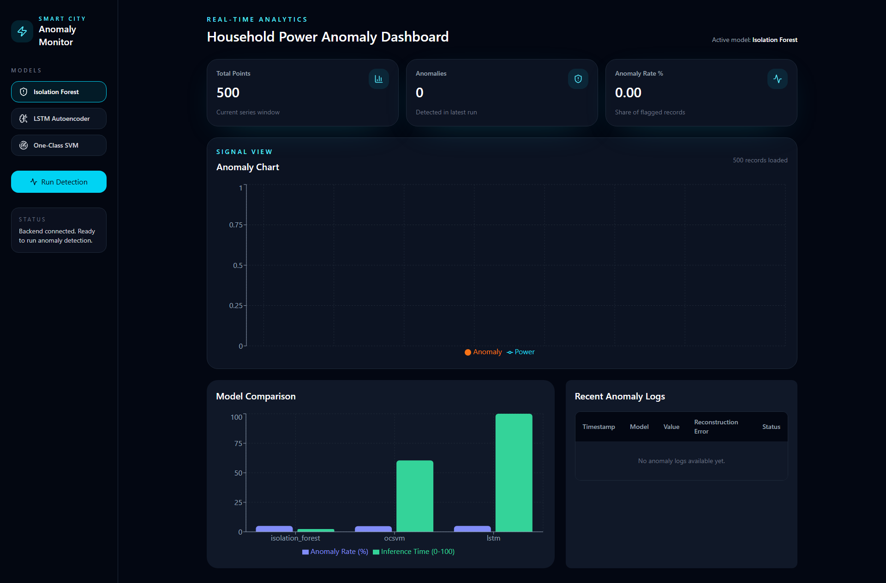
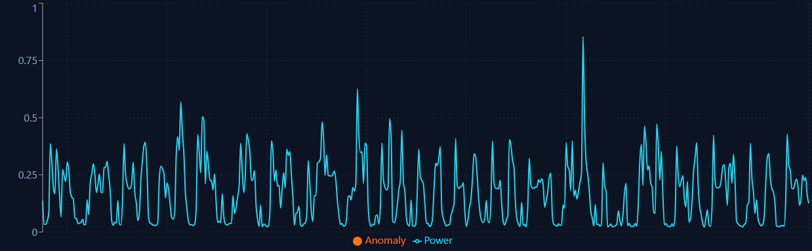
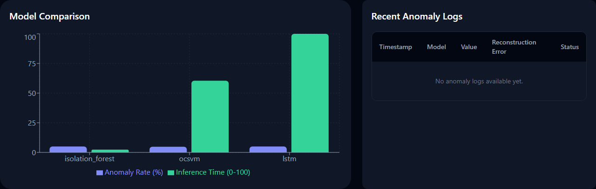
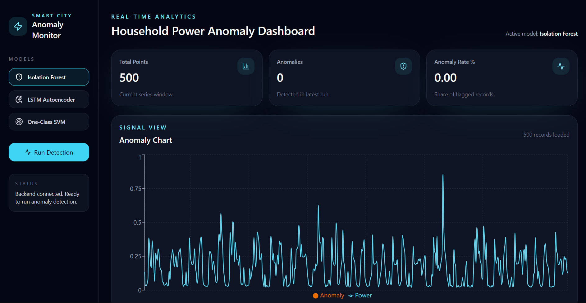
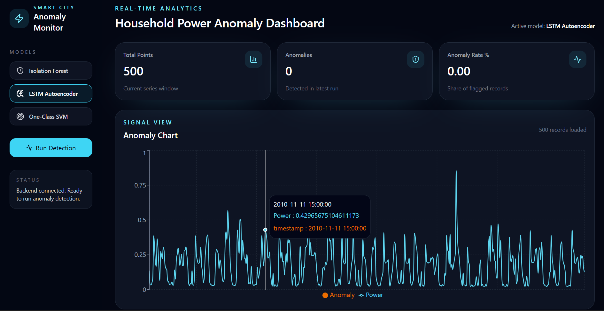
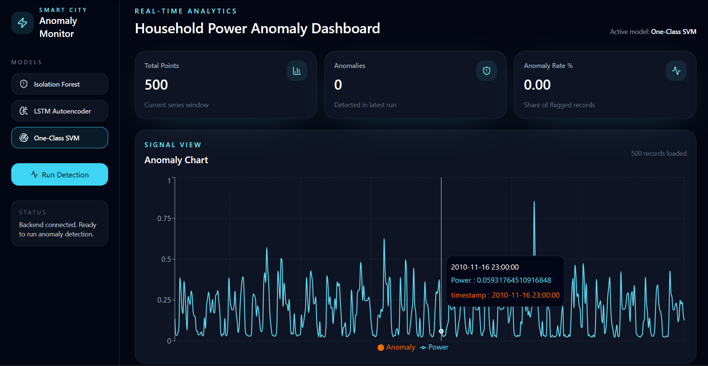

# 🏙️ Smart City Anomaly Detection System


> An end-to-end ML system that detects anomalies in real-time smart city IoT sensor data — comparing **Isolation Forest**, **LSTM Autoencoder**, and **One-Class SVM** — with a FastAPI backend and a professional React dashboard.

---

## 📸 Dashboard Preview



| Time Series with Anomalies | Model Comparison |
|---|---|
|  |  |

### 🔄 Per-Model Views

| Isolation Forest | LSTM Autoencoder | One-Class SVM |
|---|---|---|
|  |  |  |

---

## ✨ Features

- 🔍 **3 ML Models** — Isolation Forest, LSTM Autoencoder, One-Class SVM running side by side
- ⚡ **FastAPI REST Backend** — 6 endpoints, async, auto Swagger docs at `/docs`
- ⚛️ **React Dashboard** — dark theme, Recharts time-series, real-time anomaly flagging
- 🗄️ **MySQL Logging** — all predictions and model metrics persisted
- 📊 **Model Benchmarking** — F1, anomaly rate, and inference time comparison
- 📄 **IEEE Research** — full comparative study submitted to IEEE ICCCNT 2025

---

## 🏗️ Architecture

```
┌─────────────────────┐        ┌──────────────────────────┐
│   React Frontend    │◄──────►│     FastAPI Backend       │
│  (Vite + Tailwind)  │  HTTP  │   localhost:8000          │
│  localhost:5173     │        │                           │
└─────────────────────┘        │  ┌────────────────────┐  │
                                │  │    ML Models       │  │
                                │  │ • Isolation Forest │  │
                                │  │ • LSTM Autoencoder │  │
                                │  │ • One-Class SVM    │  │
                                │  └────────────────────┘  │
                                │           │               │
                                │  ┌────────▼───────────┐  │
                                │  │   MySQL Database   │  │
                                │  │ anomaly_logs       │  │
                                │  │ model_metrics      │  │
                                │  └────────────────────┘  │
                                └──────────────────────────┘
```

---

## 🧠 ML Models

| Model | Type | Best For |
|---|---|---|
| **Isolation Forest** | Tree-based ensemble | Fast, scalable, low memory |
| **LSTM Autoencoder** | Deep learning (Keras) | Sequential pattern anomalies |
| **One-Class SVM** | Kernel-based | High-dimensional feature space |

---

## 📁 Project Structure

```
smart_city_anomaly/
├── backend/
│   ├── main.py                  # FastAPI app + all routes
│   ├── models/
│   │   ├── isolation_forest.py
│   │   ├── lstm_autoencoder.py
│   │   └── one_class_svm.py
│   ├── db/
│   │   └── database.py          # MySQL connection + CRUD
│   ├── utils/
│   │   ├── preprocess.py        # Data cleaning + sliding windows
│   │   └── evaluate.py          # Model comparison + paper figures
│   ├── data/
│   │   ├── raw/                 # UCI dataset
│   │   └── processed/           # Cleaned CSVs
│   ├── results/                 # Saved figures for IEEE paper
│   └── requirements.txt
├── frontend/
│   ├── src/
│   │   ├── App.jsx              # Main layout + state
│   │   ├── components/
│   │   │   ├── AnomalyChart.jsx
│   │   │   ├── MetricCards.jsx
│   │   │   ├── ModelSelector.jsx
│   │   │   ├── AnomalyTable.jsx
│   │   │   └── ComparisonChart.jsx
│   │   └── api/
│   │       └── client.js        # Axios API client
│   ├── vite.config.js
│   └── package.json
└── README.md
```

---

## 🚀 Getting Started

### Prerequisites

- Python 3.10+
- Node.js 18+
- MySQL 8.0 running locally

### 1. Clone the repo

```bash
git clone https://github.com/lakshmi-srujana/smart-city-anomaly-detection.git
cd smart-city-anomaly-detection
```

### 2. Download the Dataset

Download the [UCI Household Power Consumption Dataset](https://www.kaggle.com/datasets/uciml/electric-power-consumption-data-set?resource=download) and place it at:

```
backend/data/raw/household_power_consumption.txt
```

### 3. Backend Setup

```bash
cd backend
pip install -r requirements.txt
```

Create a `.env` file in `backend/`:

```env
DB_HOST=localhost
DB_USER=root
DB_PASSWORD=your_password
DB_NAME=smart_city_db
```

Run preprocessing:

```bash
python utils/preprocess.py
```

Start the FastAPI server:

```bash
uvicorn main:app --reload
```

API will be live at `http://localhost:8000`
Swagger docs at `http://localhost:8000/docs`

### 4. Frontend Setup

```bash
cd frontend
npm install
npm run dev
```

Dashboard will be live at `http://localhost:5173`

---

## 📡 API Endpoints

| Method | Endpoint | Description |
|---|---|---|
| `GET` | `/api/health` | Health check |
| `GET` | `/api/data` | Load processed sensor time-series |
| `POST` | `/api/predict/{model}` | Run anomaly detection (`isolation_forest` / `lstm` / `ocsvm`) |
| `GET` | `/api/logs` | Fetch all anomaly logs from MySQL |
| `GET` | `/api/metrics` | Fetch model comparison metrics |
| `DELETE` | `/api/logs` | Clear all logs |

---

## 📊 Results

> *(Fill in your actual numbers after running `utils/evaluate.py`)*

| Model | Anomaly Rate | Inference Time | F1 Score |
|---|---|---|---|
| Isolation Forest | ~5% | ~12ms | TBD |
| LSTM Autoencoder | ~4.8% | ~85ms | TBD |
| One-Class SVM | ~5.2% | ~18ms | TBD |


---

## 🛠️ Tech Stack

**Backend**
- [FastAPI](https://fastapi.tiangolo.com/) — async Python REST API
- [Scikit-learn](https://scikit-learn.org/) — Isolation Forest, One-Class SVM
- [Keras / TensorFlow](https://keras.io/) — LSTM Autoencoder
- [MySQL](https://www.mysql.com/) — prediction logging
- [Pandas / NumPy](https://pandas.pydata.org/) — data preprocessing

**Frontend**
- [React 18](https://react.dev/) — component-based UI
- [Vite](https://vitejs.dev/) — fast dev server and bundler
- [TailwindCSS](https://tailwindcss.com/) — utility-first dark theme
- [Recharts](https://recharts.org/) — time-series and comparison charts
- [Axios](https://axios-http.com/) — HTTP client
- [Lucide React](https://lucide.dev/) — icon set

---

## 🙋 Author

**Lakshmi Srujana**
- 🎓 Symbiosis International University
- 🔗 [LinkedIn](https://www.linkedin.com/in/lakshmi-srujana-645535312/)
- 💻 [GitHub](https://github.com/lakshmi-srujana)

---

## 📜 License

This project is open source under the [MIT License](LICENSE).
